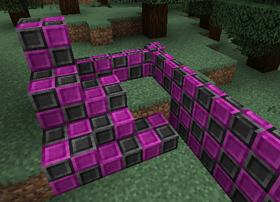
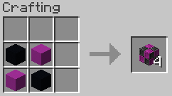

## Missing Bricks

Ever wanted your favourite missing texture as a block? Then this mod is a perfect one for you! It adds bricks with the
theme of the missing block texture. They are available as blocks, slabs, stairs and walls.



### [Download v1.0](https://maven.shadew.net/net/shadew/missing/1.0/missing-1.0.jar)

### Crafting recipe

The bricks can be crafted using black and magenta concrete:



These bricks can be further crafted into slabs, stairs and walls just using the usual patterns, or via the stonecutter.

### Credits

- Code by [ShadewEnder](https://github.com/ShadewEnder)
- Texture by [paulevsGitch](https://github.com/paulevsGitch)

### Artifact

If, for some weird reason, you need this mod in your development environment, you can grab it from my maven:

```groovy
repositories {
    maven { url "https://maven.shadew.net/" }
}

dependencies {
    modImplementation "net.shadew:missing:1.0"
}
```

### Have fun!
